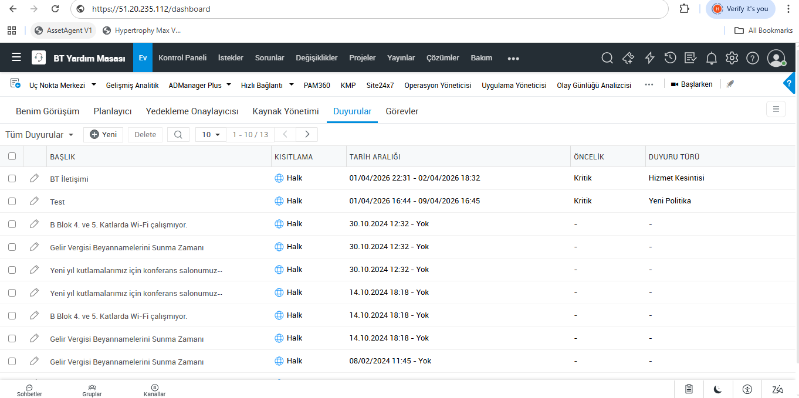
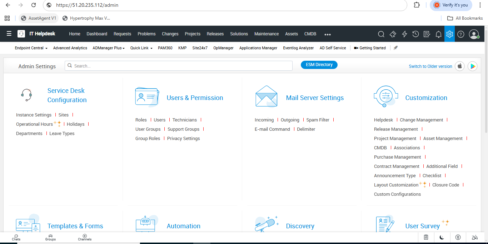
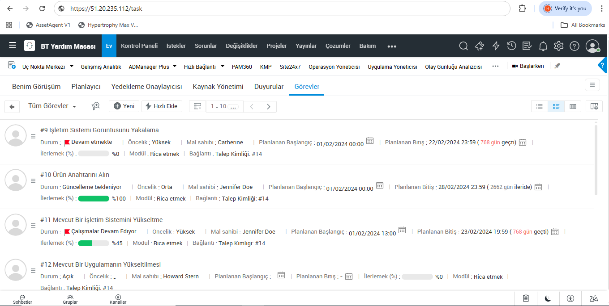
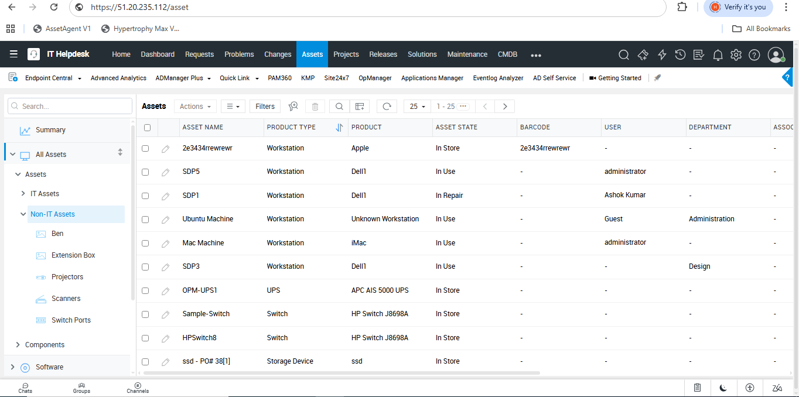
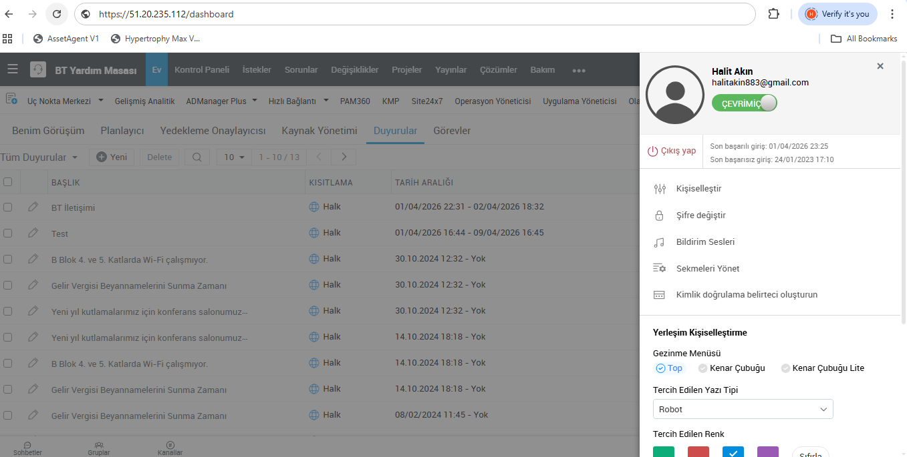

# 🛡 ServisNode — Next-Gen Kurumsal Destek ve Varlık Yönetim Sistemi

[](https://opensource.org/licenses/MIT) 
[](https://nextjs.org/) 
[](https://www.postgresql.org/) 
[](https://www.prisma.io/)

ServisNode, modern işletmelerin operasyonel ihtiyaçlarını merkezi bir platformdan yönetmek için tasarlanmış, yüksek performanslı ve ölçeklenebilir bir **Ticket & Asset Management** çözümüdür. Teknik destek süreçlerini otomatize ederken, envanter takibi ve kullanıcı yönetimi gibi kritik süreçleri tek bir merkezde birleştirir.

---

## 📸 Modül Analizi

### 1. Operasyonel Kontrol Merkezi (Dashboard)
Sistemin kalbi olan bu ekran, ekiplerin o anki iş yükünü, açık talepleri ve kritik uyarıları anlık olarak görmesini sağlar. Dinamik grafikler ile performans metrikleri (KPI) takip edilebilir.



### 2. Admin Kontrol Paneli
Yönetici paneli üzerinden sistem konfigürasyonları, rol tabanlı erişim kontrolü (RBAC) ve yetkilendirme süreçleri yönetilir. Kurumsal hiyerarşiye uygun bir yönetim katmanı sunar.



### 3. Görev ve Ticket Yönetimi
Destek taleplerinin oluşturulması, atanması ve önceliklendirilmesi süreçlerini kapsar. Her bir ticket, detaylı bir iş akışı ve tarihçe takibi ile sonuçlandırılır.



### 4. Varlık (Asset) Envanteri
Sadece IT değil, "Non-IT" varlıkların da takibini sağlayan gelişmiş bir modüldür. Garanti takibi, zimmetleme ve varlık lokasyon yönetimi gibi özellikler içerir.



### 5. Kullanıcı ve Profil Yönetimi
Sistemdeki tüm paydaşların (Teknisyen, Müşteri, Yönetici) kişisel ayarları, bildirim tercihleri ve aktivite dökümleri bu modül üzerinden yönetilir.



---

## 🚀 Kurulum ve Başlatma

Projenin geliştirme ortamında çalıştırılması için aşağıdaki adımları izleyebilirsiniz:

1. **Bağımlılıkları Yükleyin:**
   ```bash
   npm install
   ```

2. **Veritabanı Şemasını Senkronize Edin:**
   ```bash
   npx prisma generate
   npx prisma db push
   ```

3. **Geliştirme Sunucusunu Başlatın:**
   ```bash
   npm run dev
   ```

---

## 🛠 Teknik Mimari ve Teknoloji Yığını

Bu proje, modern web ekosisteminin en güncel ve kararlı kütüphaneleri kullanılarak inşa edilmiştir:

- **Frontend**: [Next.js 14+](https://nextjs.org/) (App Router ile SSR ve Streaming desteği)
- **Arayüz Tasarımı**: [TailwindCSS](https://tailwindcss.com/) & [Shadcn UI](https://ui.shadcn.com/) (Hızlı, modern ve responsive tasarım)
- **State Management**: [TanStack Query](https://tanstack.com/query/latest) (Sunucu durumu yönetimi) & [Zustand](https://docs.pmnd.rs/zustand/getting-started/introduction) (İstemci tarafı durum yönetimi)
- **Veritabanı Katmanı**: [Prisma ORM](https://www.prisma.io/) ile [PostgreSQL](https://www.postgresql.org/)
- **Kimlik Doğrulama**: [NextAuth.js](https://next-auth.js.org/) (JWT tabanlı güvenli oturum yönetimi)
- **İkon Seti**: [Lucide React](https://lucide.dev/)

---

## 📜 Lisans
Bu proje özel bir kurumsal yazılım prototipidir. Tüm hakları saklıdır.
